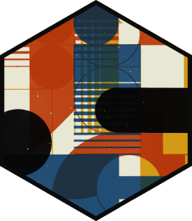
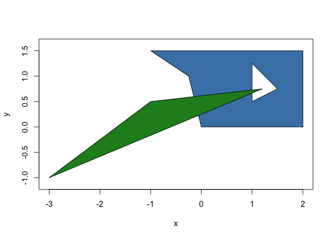
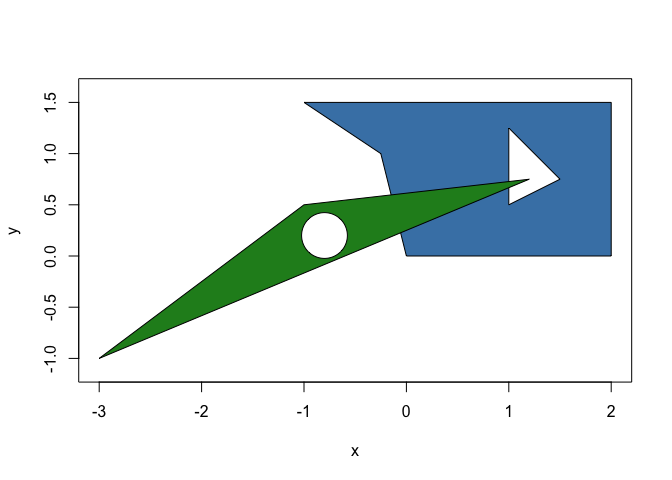
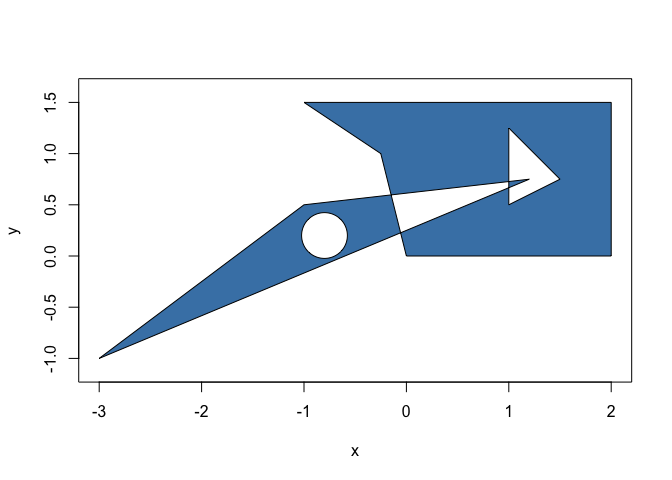
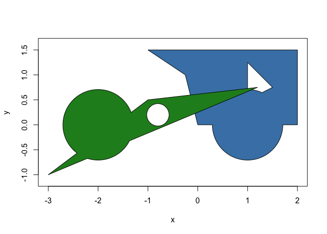

<!-- README.md is generated from README.Rmd. Please edit that file -->

# polyclid <a href='https://polyclid.r-euclid.com'></a>

<!-- badges: start -->

[](https://github.com/thomasp85/polyclid/actions/workflows/R-CMD-check.yaml)
[](https://app.codecov.io/gh/thomasp85/polyclid?branch=main)

<!-- badges: end -->

polyclid extents the computational geometry framework provided by
[euclid](https://r-euclid.com) by providing base classes and algorithms
for working with 2D polygons and polylines. The new classes provided by
polyclid are:

- *polyline:* A line consisting of several segments joined consecutively
  at their end points

- *polygon:* A polygon optionally with holes but without any “islands”
  (e.g. no disjoint parts). The polygon can be unbounded, i.e. it
  extents infinitely on the plane

- *polyline_set:* A collection of polylines especially useful as
  intermediary representation for some workflows as it facilitates line
  sweeping

- *polygon_set:* Like above but for polygons. Boolean operations on
  polygons will create sets as the result may be disjoint areas

As for algorithms, to the extent that it makes sense all methods
provided by euclid has a counterpart in polyclid. Further, methods
specific to polygons and polylines are provided such as 2D boolean set
operations, polygon validation, etc.

It is not intended that polyclid provides the full set of
polygon-centric operations, rather this is the foundational package that
other packages in the euclid ecosystem builds upon for more specialized
algorithms.

## Installation

You can install the development version of polyclid like so:

``` r
devtools::install_github("thomasp85/polyclid")
```

## Example

Polygons are areas in 2 dimensions, often bounded by an outer ring and
possibly with holes. In polyclid it is not possible for a polygon to be
disjoint, i.e. it cannot have islands outside the outer ring or inside
the holes.

``` r
library(polyclid)

# Create a polygon by specifying the x and y coordinates of the rings
p <- polygon(
  x = c(0, 2, 2, -1, -0.25, 1, 1, 1.5, 1.2, -1, -3),
  y = c(0, 0, 1.5, 1.5, 1, 0.5, 1.25, 0.75, 0.75, 0.5, -1),
  id = c(1, 1, 1, 1, 1, 1, 1, 1, 2, 2, 2),
  hole_id = c(1, 1, 1, 1, 1, 2, 2, 2, 1, 1, 1)
)
p
#> <2D polyclid_polygons [2]>
#> [1] [Boundary: 5, Range: <<-1, 0>, <2, 1.5>>, Holes: 1]    
#> [2] [Boundary: 3, Range: <<-3, -1>, <1.2, 0.75>>, Holes: 0]
```

``` r
plot(p, col = c("steelblue", "forestgreen"))
```



The polygon type works in much the same way as the base euclid types and
responds to the same methods where appropriate:

``` r
approx_area(p)
#> [1] 3.625 1.400
```

``` r
cardinality(p)
#> [1] 8 3
```

``` r
vert(p)
#> <2D points [11]>
#>  [1] <x:0, y:0>      <x:2, y:0>      <x:2, y:1.5>    <x:-1, y:1.5>  
#>  [5] <x:-0.25, y:1>  <x:1, y:0.5>    <x:1, y:1.25>   <x:1.5, y:0.75>
#>  [9] <x:1.2, y:0.75> <x:-1, y:0.5>   <x:-3, y:-1>
```

``` r
has_inside(p, point(0, 1))
#> [1]  TRUE FALSE
```

But also have additional methods and predicates, e.g.

``` r
is_convex(p)
#> [1] FALSE  TRUE
```

``` r
hole(p[2]) <- circle(point(-0.8, 0.2), 0.05)
plot(p, col = c("steelblue", "forestgreen"))
```



Of particular note are the full set of 2D boolean operations fully
vectorised along two vectors of polygons, or as a cumulative operation
along one vector

``` r
p_symdif <- symmetric_difference(p)
plot(p_symdif, col = "steelblue")
```



``` r
circles <- circle(point(c(1, -2), c(0, 0)), 0.5)
p_union <- union(p, circles)
plot(p_union, col = c("steelblue", "forestgreen"))
```



This is just a taster. Explore the vignette for an in-depth overview.

## Code of Conduct

Please note that the polyclid project is released with a [Contributor
Code of
Conduct](https://contributor-covenant.org/version/2/0/CODE_OF_CONDUCT.html).
By contributing to this project, you agree to abide by its terms.
